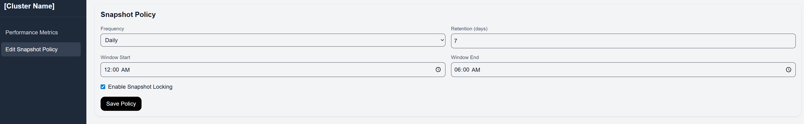

# Cluster Monitoring Dashboard

A full-stack project providing **cluster performance monitoring** and **snapshot policy management**.

This project consists of:

- **Backend (AdonisJS API)**
  - Provides **time-series metrics** for IOPS and Throughput.
  - Exposes **snapshot policy management** endpoints (GET & PUT).
  - Identifies clusters using **UUID**.

- **Frontend (Next.js + TailwindCSS + Recharts)**
  - Dashboard for **time-series performance metrics** visualization.
  - Form-based UI to **view and configure snapshot policies**.
  - Sidebar navigation to switch between views.

---

## Features

- **Performance Metrics Dashboard**
  - Displays cluster **IOPS (read/write)** and **Throughput (read/write)**.
  - Uses [Recharts](https://recharts.org/en-US) for plotting interactive line charts.
  - Fetches data via API using Axios.

- **Snapshot Policy Management**
  - Form UI for setting **frequency**, **retention days**, **snapshot window (start & end times)**, and **locking**.
  - Persists changes through API `PUT /clusters/:uuid/snapshot-policy`.
  - Fetches current config with `GET /clusters/:uuid/snapshot-policy`.

- **Sidebar Navigation**
  - Switch between **Performance Metrics** and **Snapshot Policy** pages seamlessly.

---

## Tech Stack

### Backend (AdonisJS)
- Framework: [AdonisJS](https://adonisjs.com/)
- Language: TypeScript
- Database: (optional, stubbed for demo — can be JSON/mock data)
- Provides REST API

### Frontend (Next.js)
- Framework: [Next.js](https://nextjs.org/)
- Styling: [TailwindCSS](https://tailwindcss.com/)
- Charts: [Recharts](https://recharts.org/)
- HTTP Client: [Axios](https://axios-http.com/)

---

## API Endpoints

### Time Series Metrics
```http
GET /clusters/:uuid/timeseries
```
Example Response:
```json
{
  "clusterId": "8c1f1e2a-6f86-4e04-9a2e-f2c79f3b2b7a",
  "points": [
    { "t": "2025-08-01T00:00:00Z", "iops_read": 80, "iops_write": 40, "throughput_read": 60, "throughput_write": 35 },
    { "t": "2025-08-01T01:00:00Z", "iops_read": 120, "iops_write": 40, "throughput_read": 70, "throughput_write": 40 },
    { "t": "2025-08-01T02:00:00Z", "iops_read": 140, "iops_write": 40, "throughput_read": 90, "throughput_write": 40 },
    { "t": "2025-08-01T03:00:00Z", "iops_read": 110, "iops_write": 40, "throughput_read": 65, "throughput_write": 40 },
    { "t": "2025-08-01T04:00:00Z", "iops_read": 160, "iops_write": 40, "throughput_read": 110, "throughput_write": 45 },
    { "t": "2025-08-01T05:00:00Z", "iops_read": 130, "iops_write": 40, "throughput_read": 95, "throughput_write": 45 }
  ]
}
```

### Snapshot Policy
```http
GET /clusters/:uuid/snapshot-policy
PUT /clusters/:uuid/snapshot-policy
```

Example Request Body:
```json
{
  "clusterId": "8c1f1e2a-6f86-4e04-9a2e-f2c79f3b2b7a",
  "frequency": "daily",
  "retentionDays": 7,
  "locked": true,
  "window": {
    "start": "00:00",
    "end": "06:00"
  }
}
```
---

## Running Locally
### Prerequisites

- Node.js 18+
- npm or yarn

### 1. Clone Repository
```bash
git clone https://github.com/prithubanerjee/cluster-monitor.git
cd cluster-monitor
```

### 2. Setup Backend (AdonisJS)
```bash
cd backend
npm install
# See .env.example to create .env
npm run dev
```

- Backend will run on http://localhost:3333

### 3. Setup Frontend (Next.js)
```bash
cd frontend
npm install
# See .env.example to create .env.local
npm run dev
```

- Frontend will run on http://localhost:3000

## Project Structure

```bash
cluster-monitor/
│
├── backend/                  # AdonisJS API
│   ├── app/
│   ├── start/
│   ├── .env.example
│   └── ...
│
├── frontend/                 # Next.js App
│   ├── app/
│   │   ├── layout.tsx        # Root layout
│   │   ├── page.tsx          # Entry point
│   │   └── ...
│   ├── components/
│   │   ├── TimeSeriesChart.tsx
│   │   ├── SnapshotPolicyForm.tsx
│   │   └── SidebarLayout.tsx
│   ├── lib/api.ts
│   └── ...
```

## Usage

- Open http://localhost:3000 to view the dashboard.

- Use the sidebar to switch between:

  - Performance Metrics (IOPS & Throughput charts with read/write lines and right-side legend)
  

  - Snapshot Policy (form with frequency, retention, window, and locking)
  
